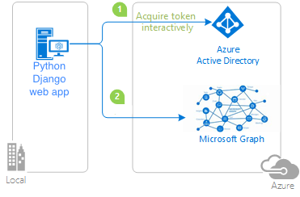

# Sample: A Python Django web project to sign in users and call APIs with the Microsoft Entra ID

This is a multi-purpose [Django](https://www.djangoproject.com/) web app sample.
Write your app like this once, and the same implementation will support 4x2=8 scenarios.

|                | Microsoft Entra ID | External ID | External ID with Custom Domain | Azure AD B2C |
|----------------|--------------------|-------------|--------------------------------|--------------|
| Web App Sign-In & Sign-Out |   ✓    |      ✓      |                ✓               |       ✓      |
| Web App Calls a web API |     ✓     |      ✓      |                ✓               |       ✓      |




## Getting Started

### Prerequisites

1. Register your web application in the Microsoft Entra admin center,
   by following step 1, 2 and 3 of this
   [Quickstart: Add sign-in with Microsoft to a Python web app](https://learn.microsoft.com/en-us/entra/identity-platform/quickstart-web-app-python-sign-in?tabs=windows)
   (Note: There will be articles on how to register your app with External ID, etc..)
1. Have [Python](https://python.org) 3.8+ installed
1. Clone from
   [its repo](https://github.com/Azure-Samples/ms-identity-python-webapp-django)
   or download its zip package, and then start using it or build on top of it.
   (Alternatively, you can follow our [tutorial](#tutorial) to learn
   how to build this from scratch, or how to add auth to your existing project.)
1. `cd project_name`
1. Run `pip install -r requirements.txt` to install dependencies
1. Run `python manage.py migrate` to initialize your Django project
1.  Run `python manage.py runserver localhost:5000` and then browse to http://localhost:5000
   You may need to change to a different port to match your redirect_uri setup.


### How to configure and use this sample

<table border=1>
  <tr>
    <th></th>
    <th>Microsoft Entra ID</th>
    <th>Microsoft Entra External ID</th>
    <th>Microsoft Entra External ID with Custom Domain</th>
    <th>Azure AD B2C</th>
  </tr>
  <tr>
    <th rowspan=2>Configuration</th>
    <td><!-- See https://github.com/github/cmark-gfm/issues/12 -->

Copy this [Entra ID template](.env.sample.entra-id)
as `.env` and then modify `.env` with your app's settings.

</td>
    <td>

Copy this [External ID template](.env.sample.external-id)
as `.env` and then modify `.env` with your app's settings.

</td>
    <td>

Copy this [CIAM Custom Domain template](.env.sample.ciam-custom-domain)
as `.env` and then modify `.env` with your app's settings.

</td>
    <td>

Copy this [Azure AD B2C template](.env.sample.b2c)
as `.env` and then modify `.env` with your app's settings.

</td>
  </tr>

  <tr>
    <td colspan=4>

Do not reverse the order of the configuration steps above.
If you put your app credentials into the template and then copy it into `.env`,
you risk accidentally committing your templates with credentials into Version Control System.

</td>
  </tr>

  <tr>
    <th>Web App Sign In & Sign Out</th>
    <td colspan=4>

With the basic configuration above,
you can now browse to the index page of this sample to try the sign-in/sign-out experience.

</td>
  </tr>

  <tr>
    <th>Web App Calls a web API</th>
    <td colspan=4>

Add the web API's *endpoint* into your `.env` file.
Also add the *scopes* it needs, separated by space.
The following example is the settings needed to call the Microsoft Graph API.
You may need to replace the their values with your own API endpoint and its scope..

```ini
ENDPOINT=https://graph.microsoft.com/v1.0/me
SCOPE=User.Read
```

Now restart this sample and try its "Call API" experience.

</td>
  </tr>
</table>

### Deployment

Once you finish testing this web app locally, you can deploy it to your production.
You may choose any web app hosting services you want.
Here we will describe how to deploy it to
[Azure App Service](https://azure.microsoft.com/en-us/products/app-service).

* Follow the ["Quickstart: Deploy a Python (Django or Flask) web app to Azure App Service"](https://learn.microsoft.com/en-us/azure/app-service/quickstart-python),
  but replace its sample app (which does not do user sign-in) with this web app.

* [Configure your app's settings](https://learn.microsoft.com/en-us/azure/app-service/configure-common?tabs=portal#configure-app-settings)
  to define
  [these environment variables](https://github.com/Azure-Samples/ms-identity-python-webapp-django/blob/main/.env.sample).

## How to build this sample (or a new web project) from scratch

You can follow the
[instructions for Django, from the underlying library](https://identity-library.readthedocs.io/en/latest/django.html).

You can refer to the
[source code of this full sample here](https://github.com/Azure-Samples/ms-identity-python-webapp-django/tree/main/mysite)
to pick up other minor details, such as how to modify `urls.py` accordingly,
and how to add templates for this new view (and for the existing `index()` view).


## Contributing

If you find a bug in the sample, please raise the issue on [GitHub Issues](../../issues).

If you'd like to contribute to this sample, see [CONTRIBUTING.MD](/CONTRIBUTING.md).

This project has adopted the
[Microsoft Open Source Code of Conduct](https://opensource.microsoft.com/codeofconduct/).
For more information, see the
[Code of Conduct FAQ](https://opensource.microsoft.com/codeofconduct/faq/)
or contact [opencode@microsoft.com](mailto:opencode@microsoft.com)
with any additional questions or comments.

